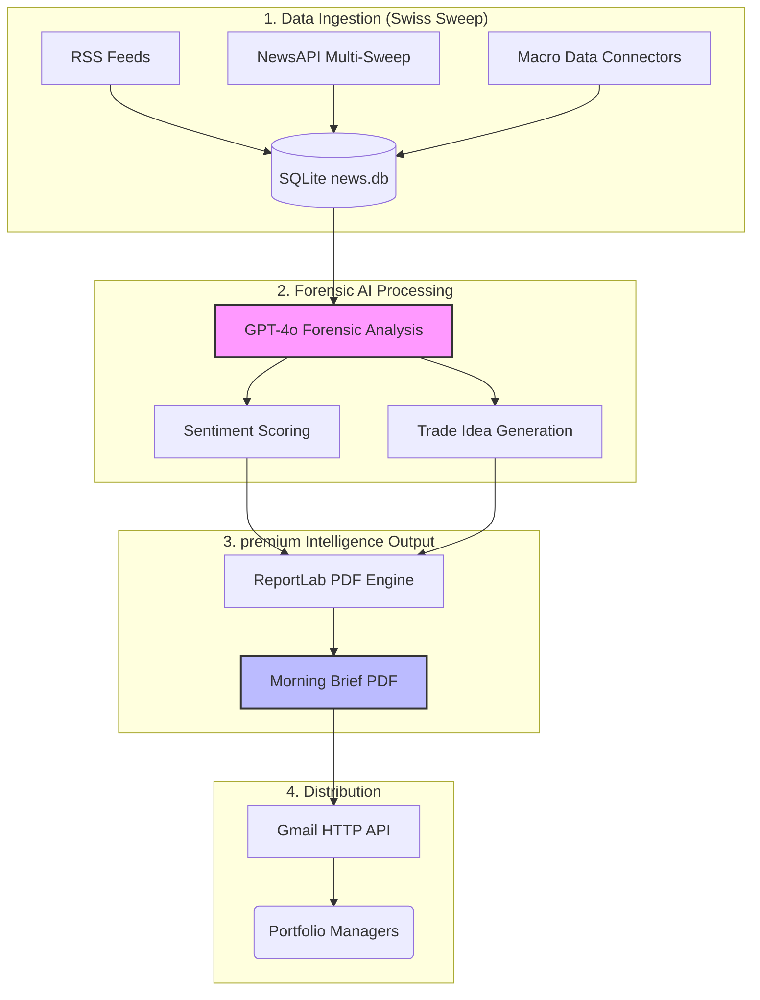

# Apeiro Investments — Institutional Financial Intelligence

Apeiro Investments is an automated, high-conviction market intelligence system designed to transform raw news headlines and macro data into forensic-grade sentiment analysis and actionable trade ideas.

Built for senior portfolio managers and tactical traders, the system generates premium morning briefs that blend qualitative news signals with quantitative market indicators.

## 🚀 System Architecture



The project is orchestrated via a modular pipeline that ensures data integrity and forensic deduplication.


### 1. Data Ingestion ("Platinum Sweep")
- **Multi-Source Ingestion**: Combines NewsAPI (Premium tier parameters), global RSS feeds (MarketWatch, Fortune, CNBC), and direct macro data hooks.
- **Institutional Tagger**: Analyzes titles and summaries across five core sectors (Tech, Energy, Healthcare, Financials, Consumer) using forensic keyword weighting.
- **Self-Cleaning Database**: Persists signals in SQLite with automated deduplication to prevent analyst fatigue.

### 2. Forensic AI Analysis
- **Hedge-Fund House View**: Leverages GPT-4o with an institutional-grade system prompt to generate normalized sentiment scores (+1 to -1).
- **Macro Integration**: Fuses raw news with hard market data (VIX, 10Y-2Y Spread, Sector ETFs) to ground the narrative.
- **Trade Generation**: Produces high-conviction ideas with explicit entry rationales and invalidation points.

### 3. Reporting & Distribution
- **Premium PDF Layout**: Generates a professional dossier with structured sector outlooks, volatility trackers, and catalyst maps.
- **Automated Dispatch**: Delivers the report daily at a scheduled time (e.g., 06:30 AM) via the Google Gmail API.

## 🛠️ Setup & Configuration

### Prerequisites
- Python 3.10+
- [NewsAPI Key](https://newsapi.org/)
- [FRED API Key](https://fred.stlouisfed.org/)
- [Finnhub API Key](https://finnhub.io/)
- GitHub Personal Access Token (for AI inference)

### Installation
```bash
# Install dependencies
pip install -r morning_brief/requirements.txt

# Configure environment
cp morning_brief/.env.example morning_brief/.env
```

### Environment Variables
Configure your `.env` file with the following:
| Variable | Description |
| :--- | :--- |
| `RECIPIENTS` | Comma-separated list of recipient emails. |
| `GMAIL_ADDRESS` | The email address sending the report. |
| `GITHUB_TOKEN` | Token for Azure AI model inference. |
| `REPORT_TIME` | 24h format for daily report generation. |

## 📁 Project Structure

- `main.py`: The central orchestrator and scheduler.
- `ai_processing.py`: Forensic analysis and LLM interaction.
- `news_ingestion.py`: "Platinum Sweep" news gathering logic.
- `data_fetcher.py`: Market data and macro indicator hooks.
- `pdf_generator.py`: Premium PDF construction using ReportLab.
- `email_delivery.py`: SMTP-alternative Gmail API delivery.

## ⚖️ Disclaimer
This system is intended for educational and research purposes only. The "Trade Ideas" and "Sentiment Scores" generated by the AI do not constitute financial advice. Always verify signal integrity with a registered financial professional.